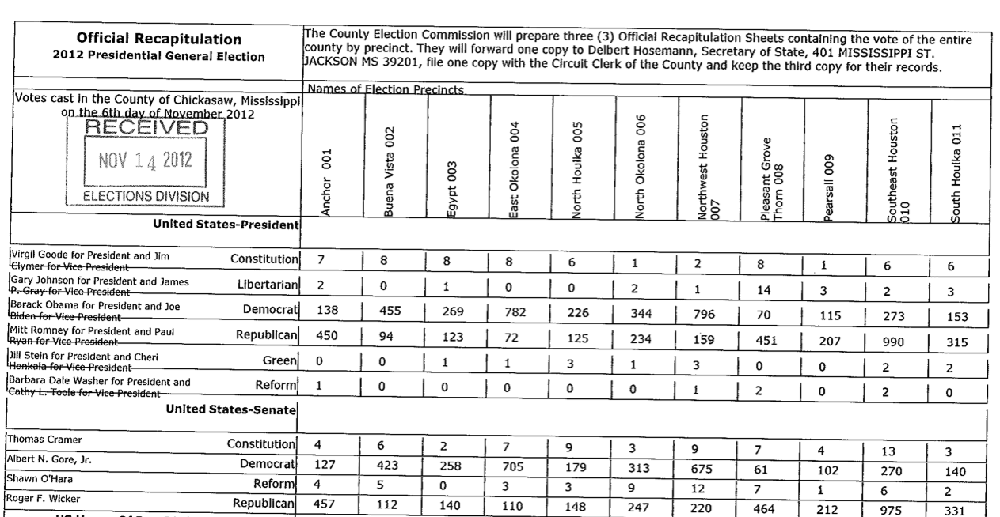
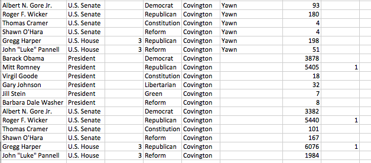

OpenElections Data Mississippi
=====================

Converted CSVs of Mississippi election results.

### The Process

TO BE CLEAR: This is data entry work. There is no magic here.

Mississippi stores election results in PDF files at [the Secretary of State's site](http://www.sos.ms.gov/elections4.aspx). The files are stored by year, and then either by race (for special elections) or by county (for primary and general elections). The county files contain precinct-level results, organized by office, with precincts labeled vertically across the top. Here's a file from the Nov. 6, 2012 general election in Chickasaw County:

File names match [the `generated_name` standard described in our docs](http://docs.openelections.net/archive-standardization/). So the CSV file to match the above example would be 20121106__ms__general__chickasaw__precinct.csv.

The OpenElections CSV layout approach is to mirror the results file as much as possible, with one exception: we try to have a single result on each line, rather than multiple candidates or precincts.

Where totals are included, we use "Total" as the county name and mark the overall winner in each race in the `winner` column, which takes a boolean value:

### Instructions

* We're only interested in federal, statewide and state legislative offices. No local offices.
* Don't include precincts which have "X" in the vote totals.
* Don't include "County" in the county name.
* Don't include "Precinct" in the name of the precinct.
* For precincts with numbers in the name, remove any leading zeros (005 becomes 5).
* Even within the same election, the order of candidates will differ between counties.

### How to Contribute

##### The Git Way

1. Fork this repository.
2. Pick an election and add it and your name to the [contributors file](contributors.csv).
3. Add CSV results files to your repository.
4. Submit a pull request when done.

##### The Non-Git Way

1. Pick an election.
2. Email openelections@gmail.com to let us know what you're working on.
3. Create CSV files.
4. Email openelections@gmail.com with the files attached or a link to the files.

### Questions

If you run into questions about the PDFs or how to enter the results, check out the [Issues](https://github.com/openelections/openelections-data-ms/issues) or file a new one.